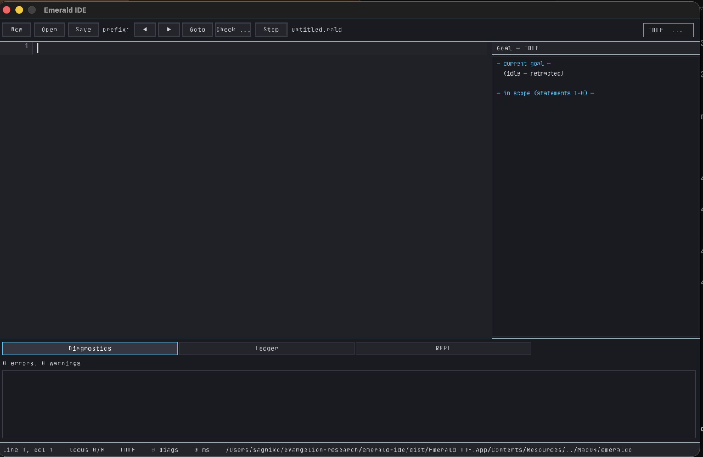

# Emerald IDE

A working, basic IDE for the Emerald language, built as a **pure Tauri app**
(Rust backend + TypeScript/Vite webview frontend), implementing the
interaction model in [`SPEC.md`](SPEC.md): a source buffer with an *accepted
prefix*, a goal panel, an obligation ledger, and a type-checking REPL.



## What it does

- **Edit `.rald` files.** Open (⌘O or the Open dialog), save (⌘S),
  save-as (⇧⌘S), new (⌘N). Line numbers, gutter, syntax highlighting via a
  vendored tree-sitter grammar for Emerald, selection, undo/redo, UTF-8 aware.
- **Prefix checking with a visible locus.** Statements are the unit of
  advance (`def`, `type`, `import`, assignments, …). The accepted prefix is
  shaded green, the failing statement red, and the in-flight region amber —
  CoqIDE-style, but the buffer stays editable: editing anywhere retracts the
  locus to the last statement before the edit and re-checks invisibly.
- **Drives the real compiler.** Every check runs
  `emeraldc --check --json` over the truncated prefix (materialised as a
  temp file next to your source, so relative imports resolve identically)
  and parses the structured diagnostics. `emeraldc` is found via `$EMERALDC`,
  `$PATH`, the bundled copy inside the `.app`, or the sibling
  `../emerald/bin/emeraldc`.
- **Goal panel & symbols.** The residual goal (the failing diagnostic's
  expected/actual) plus a source-derived environment of the accepted prefix:
  function signatures, type aliases, and annotated bindings.
- **Obligation ledger.** `impossible: never =` bindings and `-> never`
  functions are detected and given a verdict — *proved*, *out of reach*, or
  *unchecked* — with a live summary line.
- **REPL.** Type an expression; it is type-checked in the scope of the
  accepted prefix via `emeraldc --check`.

## Keybindings

| Action | Binding |
|---|---|
| advance | ⌘↓ |
| retract | ⌘↑ |
| goto cursor | ⌘→ |
| check all | ⌘⏎ |
| interrupt (drop diagnostics) | ⌘. |
| panels: goal / symbols / ledger / diagnostics / repl | ⌘1 – ⌘5 |
| cycle panel | ⌘[ / ⌘] |
| open / save / save-as / new | ⌘O / ⌘S / ⇧⌘S / ⌘N |
| undo / redo | ⌘Z / ⇧⌘Z |

The toolbar also exposes prefix controls for mouse users (◀ ▶ Goto Run).

## Build and run

Requires [Node.js](https://nodejs.org), [Rust](https://rustup.rs), and the
platform webview prerequisites (on macOS: Xcode command-line tools).

```sh
npm install
npm run tauri dev     # dev app with hot reload
npm run tauri build   # release bundle (.app / .dmg)
```

The frontend builds with Vite (`npm run build`) into `dist/`, which Tauri
packages (`src-tauri/tauri.conf.json`). The tree-sitter grammar for Emerald is
vendored under `src-tauri/grammar/` and compiled into the binary by
`src-tauri/build.rs`.

## Compiler resolution

`emeraldc` is resolved at startup from `$EMERALDC`, then the one bundled
inside the `.app` (which also points `$EMERALD_STDLIB` at the bundled stdlib),
then `$PATH`, then `../emerald/bin/emeraldc` (the sibling checkout of the
compiler). The status bar shows which one is in use.

## Layout

```
index.html           webview shell (titlebar, editor layers, rail, statusbar)
src/main.ts          app wiring: toolbar, keybindings, file dialogs
src/editor.ts        layered code editor over a textarea (gutter, regions)
src/session.ts       proof-session state machine (advance/retract/goto/check)
src/ipc.ts           typed wrappers around the Tauri commands
src/panels.ts        goal / symbols / ledger / diagnostics / REPL rail
src/theme.ts         theme registry + picker
src/styles/          base.css, themes.css
src-tauri/src/lib.rs Tauri commands: analyze, check, read/write file,
                     compiler discovery, subprocess runner
src-tauri/src/emerald.rs  tree-sitter analysis (tokens, statements, symbols)
src-tauri/grammar/   vendored tree-sitter grammar for Emerald
```
